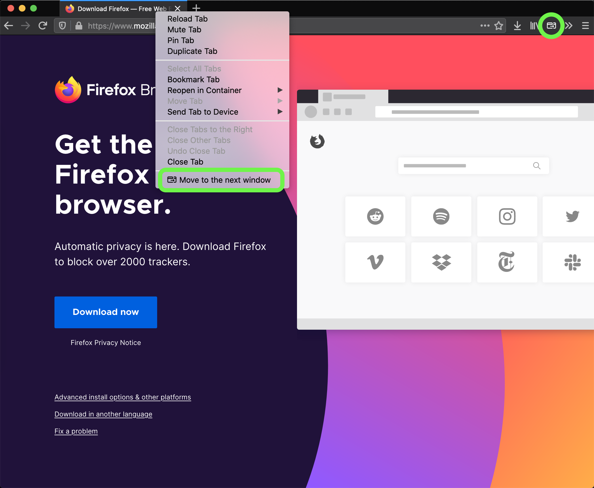

# Move Tab to Next Window browser extension

A browser extension which adds a tab context menu item (Firefox) and a button action (Firefox & Chrome) to move a tab to the next window.

Especially useful for these amazing multi-monitor setups when it's too annoying to drag tabs around between windows.

- Mozilla Firefox: https://addons.mozilla.org/en-GB/firefox/addon/move-tab-to-next-window/
- Microsoft Edge: https://microsoftedge.microsoft.com/addons/detail/ndjiippfnecdmbjenbcnjdbjnopkamno
- Google Chrome: https://chrome.google.com/webstore/detail/move-tab-to-next-window/ibpemckpjfpmhlagogddlajhaiemdjaf

## Quick feature list

- the source tab position is saved in all windows, so if it's moved back into a window, it moves into its original position
- CHROMIUM: if the tab was in a tab group, when moving back to original window it will return into the same group
- multiple tabs move - select multiple tabs (use shift or cmd/ctrl) and move all of them into the next window in the same order
- if the tab is active, it will become active in the new window
- if the tab is inactive, it will stay inactive in the new window
- if there is only 1 window, a new window will be opened on move

## Technologies used

- TypeScript in strict mode for safety
- Microbundler to build and transpile ts changes
- `webextension-polyfill` for compatibility with both Firefox and Chrome
- ESLint for linting

## Contributions are welcome

Prerequisites:

- Node and NPM
- VS Code (recommended)

How to contribute:

- fork the project
- `npm install`
- `npm run dev-ff` or `npm run dev-chrome`, load unpacked extension from `dist` directory.
- make changes, open a PR
